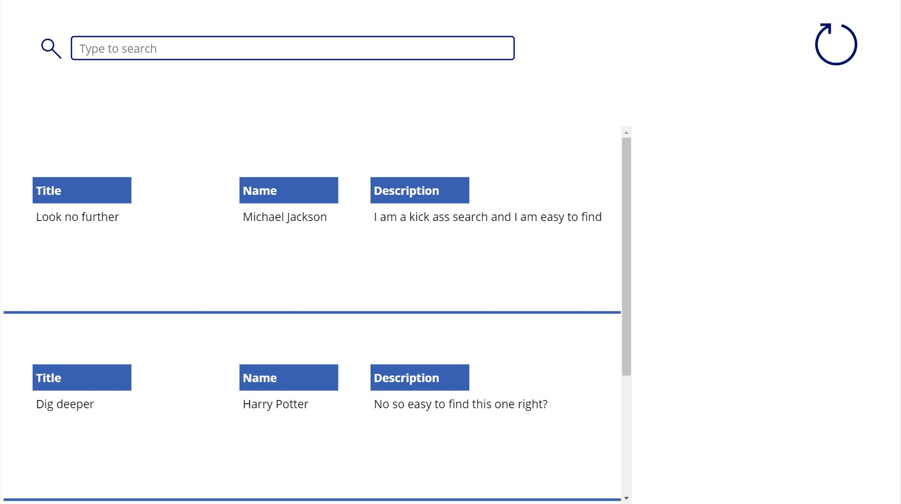
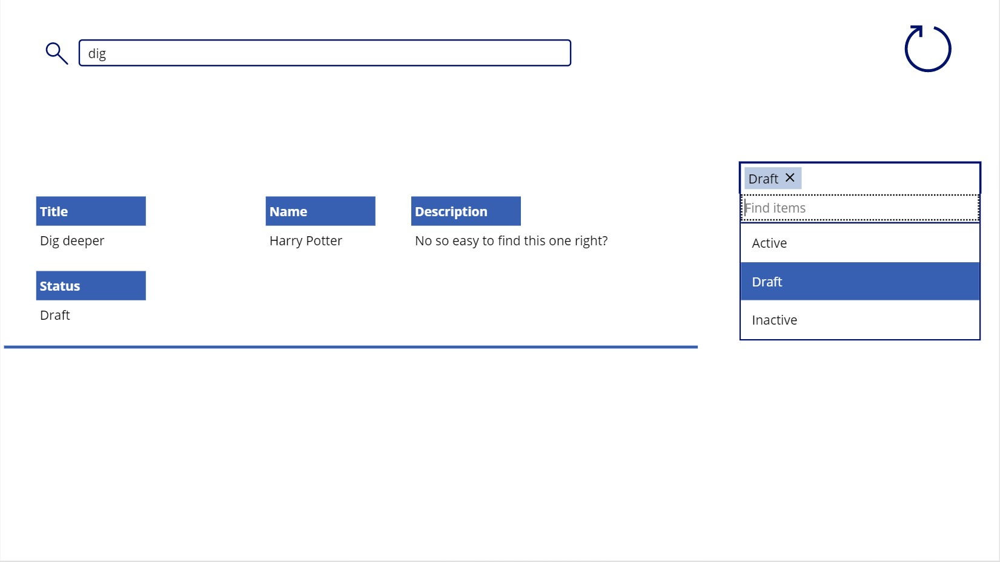
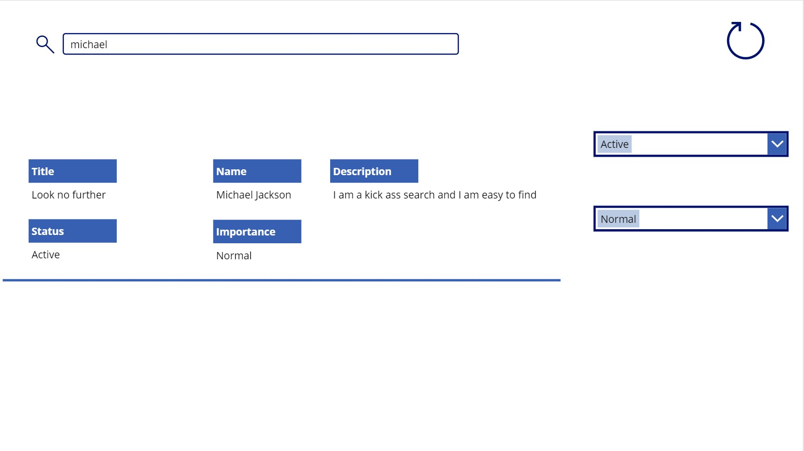

# The Canvas App Search box
Scraping up the the internet, forums, etc. there are loads of examples of how to connect a simple text box with a Gallery and turn it into what it looks like some basic search box. But what if your needs are more complex and maybe you need to let's say search through a combined collection of fields or maybe have your search feature take into account some filter functionality?
I've literally hit this bump into the road with every app I have built.

Let's face it, any app these days has some pretty well defined expectations for the search experience, and if haven't gone through loads of development scenarios, you would either create a non-scalable mess, or perhaps create something that takes the user back in 1995.

Here's what I think search should be in any app, from both the Dev and User perspective:

**User**
* Search should lookup all relevant fields
* Should take into account filters
* Should happen as the user starts typing in
* It should be obvious that the field is a Search Box

**Dev**
* It must be obvious how this works
* It must be easy to add more fields into the search soup
* It must have a single location where changes would be made
* It must be documented and well tested

So lets build a search experience that satisfies the above criteria.

## Pre-requisites
Here's what I've prepared for this session:

**SharePoint List**
* Create a SharePoint List with the following fields (*Single line of text*): `Title`, `Names`, `Description`
* Ad a couple of items with various text. Some items should have unique text, some should not.

**Canvas App**
* Create a new Canvas App from Blank (I've created a Tablet app)
* In your new App, in `Screen1`, create the the following:
    * Add a new Data Source. Make this the SharePoint List we have created earlier (mine is called `Test_Search`)
    * A blank gallery (you can leave its name the default `Gallery1`). Resize it to about 3/4 of your app width, and 3/4 your app height. Drag it to the left bottom corner.
    * An Icon that you can place somewhere in the far right upper corner (I used the Reload Icon). Name the Icon `ICN_Refresh`
    * A Text Input control. Name it `TXT_Search`. Place this somewhere in the far left upper corner
    * Another Icon that you resize to match the height of `TXT_Search` and you place it to the left of the control. Name it `ICN_Search`

We will come back to adding some labels into `Gallery1` but after we load the `Test_Search` data source into a Collection.
We could have just worked with the `Test_Search` data source directly, but if this would have been a real word app with loads of data, you would have had some Delegation issues as the data source filtering uses `in` to look at a combined dataset.

> Touching base on that, me personally, I never ever add the data source directly into a Gallery. This is incosiderate from an Architecture point of view, and it will get you in trouble soon regardless of which angle you view this from. Requirements often change, and most likely at some point you need to do some `Filter` here and there. Most operators will end in Delegation issues when used in `Filter`, so just to have evrything future proof and a breeze to work with, I always implement a strategy that allows me to load the data locally in Collections. I will post a full topic about "Working with Data inside Canvas Apps" at a later date though.

So, select the `ICN_Refresh` icon, go to the `OnSelect` property, and paste the below snippet in:

```
ClearCollect(COL_Search, Test_Search)
```

Now `Play` your app. And click on the Refresh Icon. This has now loaded the `Test_Search` data into a Collection called `COL_Search`.

Let do some tidy up as well. I often tend to be a perfectionist, so let's select the `TXT_Search` Search Box, go to the `Hint Text` property, and change it to "Type to search"

> Another thing that has drawn my attention on Icons is the fact that eventhough the icon does nothing, on hover it displays a hand. This gives the impression that the Icon is selectable and it should do something. I've fixed that by insterting a new Label control, remove the text, and place it on top of the icon. Not very elegant, but until we get more control on these things from Microsoft, well, its a fix.

Now let's sort out `Gallery1`:

**Data Source**

Select `Gallery1`, go to the `Items` property, and paste the below expression:
```
If(
    IsBlank(TXT_Search.Text),
    COL_Search,
    Filter(
        COL_Search,
        TXT_Search.Text in Concatenate(
            Title,
            " ",
            Names,
            " ",
            Description
        )
    )
)
```

This is what happens in the above expression:
* We start with an `If` statement and validate if the `TXT_Search` search box has any text
* If the statement evaluates as `true` then the user is not searching for anything, so we give him/her unfiltered information (that is data from the `COL_Search` Collection)
* If the statement evaluates as `false` then the user has typed something in the Search Box, so we need to see if what the user has typed in so far exists in any of the 3 fields. We do this applying a `Filter` expression on `COL_Search` where we check to see if the text typed by the user so far exists in any of the 3 fields. To combine the text values of the 3 fields, we use the `Concatenate` function and we make sure we add a space between each field (that is so words don't join together)

We need to be able to see this happening in `Gallery1` so let's add some labels there to display data:
* Add 3 labels and name them as follows: `LBL_Description_Label`, `LBL_Name_Label`, `LBL_Title_Label`. Change their Fill to Blue and Color to White
* Add 3 more labels and name them as follows: `LBL_Description_Value`, `LBL_Name_Value`, `LBL_Title_Value`

Set the `Text` property of the below labels as follows:
* `LBL_Description_Value` = `ThisItem.Description`
* `LBL_Name_Value` = `ThisItem.Names` (Please be carefull here. `ThisItem.Names` it is Names not Name. So easy to make a mistake really)
* `LBL_Title_Value` = `ThisItem.Title`

Change the Text of the following labels to the following static text values:
* `LBL_Description_Label` = "Description"
* `LBL_Name_Label` = "Name"
* `LBL_Title_Label` = "Title"

Stack the actual labels on top of the dynamic data labels so your app looks at least close to the below:




Now try the Search Box. If you have followed the instructions correctly, the Gallery should filter results out as you type. The Search sould also look into all 3 fields. And guess what, because we have used a Collection, your App Checker is a happy chap with no errors or Delegation warnings.

But the real gain here is that you have a way to Refresh your data, a search box that is lightning fast, and a single location where you can maintain your search functionality (the `Items` proper of `Gallery1`). And not to mention the fact that you are not doing additional API calls when Delegating to the data source, and that the whole User Experience is really fast.

So in the future, if your SharePoint Data Source gets more columns, you can easily add these to the `Concatenate` function in the `Items` property in `Gallery1`. Just make sure you separate columns with a space.

Also, if you are then being asked to add a section with DropDown filters, you can again just add these to the `Concatenate` function. But in this scenario you might need to consider that additional filters would have to work regardless of whether the Search Box has text or not. So let's see how we do that.

## Search with Filters (One Combo Box Filter)

The following functionality will build on top of what we have built above. In most scenarios, there would be various filters that would target a Gallery and they would have to work in conjunction with your search functionality and perhaps other filters.

But the base idea is this: You need to make sure that the path you take and the expressions you write are scalable. This means that if let's say your current requirement is you add a dropdown to filter your Gallery by Item Status, and later down the line your data source will expand in columns, you shouldn't have to re-write the whole expression and change strategy to add more filters to your Gallery.

> You should plan your strategy in such a way that you can simply add to the existing expression rather than re-engineer the whole thing. This will save you a lot of hassle in the future, and your app will be scalable and adding functionality to it should be a breeze. Let's face it, if your expressions are not scalable, what would your client think when you would say that it takes days to add a single additional filter to a list. Or even worst, to say that you can't with the way the app was built.

So let's stage this. Go back to your SharePoint List, and add a Choice Column called `Status` with the following choices: `Active`, `Draft`, `Inactive`

Then go through each Item you have created in your SharePoint List, and select a different Choice in the new column for each item.

Now go back to the app, go to `View`, `Data sources`, click on the 3 dots to the right of the source that links to your SharePoint List, and click `Refresh`

You've now got all new data and new column in your data source. We now need to refresh our Collection used as a data source in `Gallery1`. So click on the Refresh Icon in the app.

Now lets add the Status labels to the Gallery. Edit `Gallery1` and add 2 labels: One called `LBL_Status_Label` with the `Text` property set as "Label", `Fill` set as Blue, and `Color` set as White. And the other name it `LBL_Status_Value` and set its `Text` property to `ThisItem.Status.Value`. Stack these two on top of each other to match the style of the other labels.

Now let's insert into the app a Combo Box Control, and place it somewhere to right side below the Refresh Icon. Name your Combo Box `CMB_Status`. Change these properties for the Combo Box as follows:
* `IsSearchable` = `true`
* `SelectMultiple` = `true`
* `Items` = `Choices(Test_Search.Status)`

You now have a multiselect Combo Box that has its own search box and its choices are the same choices as the Status field.
Now let's add this to the Search soup.

Before I post the full expression that goes into the `Items` property of `Gallery1` let's think about what needs to happen next:
* We now pottentially have to deal with two `Filter` that looks at 2 controls
* One of the controls can also have multiple choices
* Because we have started with an extremely simplistic case we've used an `If` statement. This will now get more complex, and while you could handle with nested `If` statements, that would get way too messy. So time to use a Switch statement.
* We would need to cover the following scenarios:
    * When the Search Box is Empty and the Combo Box has no selection
    * When the Search Box is Not Empty and the Combo Box has no selection
    * When the Search Box is Not Empty and the Combo Box has a selection
    * When both the Search Box and the Combo Box have values

To make your expression easier to read and understand you would need to use a Switch with 2 conditions and on each condition the Match_Result will be an `If` statement that will check whether your Combo Box has any selection or not. The output of each `If` statement will be as follows:
* If the Search Box is Blank
    * And if the Combo Box is Empty then output `COL_Search` as is
    * If the Combo Box is Not Empty then output `COL_Search` filtered by Status. You would say `Status.Value in CMB_Status.SelectedItems.Value` as your `Filter` condition
* If the Search Box is Not Blank
    * And if the Combo Box is Empty then output `COL_Search` with the original `Filter` as follows: `Filter(COL_Search,TXT_Search.Text in Concatenate(Title," ",Names," ",Description))`
    * If the Combo Box is Not Empty then output `COL_Search` with the original `Filter` and the `Filter` that looks into the Combo Box selections. You would say `Filter(COL_Search,TXT_Search.Text in Concatenate(Title," ",Names," ",Description),Status.Value in CMB_Status.SelectedItems.Value))`

Below is the full expression:
```
Switch(
    true,
    IsBlank(TXT_Search.Text),
    If(
        CountRows(CMB_Status.SelectedItems) > 0,
        Filter(
            COL_Search,
            Status.Value in CMB_Status.SelectedItems.Value
        ),
        COL_Search
    ),
    Not IsBlank(TXT_Search.Text),
    If(
        CountRows(CMB_Status.SelectedItems) > 0,
        Filter(
            COL_Search,
            TXT_Search.Text in Concatenate(
                Title,
                " ",
                Names,
                " ",
                Description
            ),
            Status.Value in CMB_Status.SelectedItems.Value
        ),
        Filter(
            COL_Search,
            TXT_Search.Text in Concatenate(
                Title,
                " ",
                Names,
                " ",
                Description
            )
        )
    )
)
```

And that is what your app should look like at this stage:



Now what if you have one search box but more that one Combo Box filters? Not a problem, let's solve this one too.

## Search with Filters (Multiple Combo Box Filters)

Withouth going into too many details, here's what we're going to do.
* We will add another Choice column in SharePoint called `Importance` with the following choices: `Normal`, `Urgent`, `Important`.
* You will then Edit each SharePoint Item and select different choices for the new added column.
* You will then follow the above instructions to Refresh your Data Source in PowerApps and then click on the Refresh Icon to add the new data to the Collection.
* For the sake of saving time and effort, make a copy of the current Combo Box in the app and place it underneath. Rename the copy as `CMB_Importance`
* Change the Items expression of the `CMB_Importance` Combo Box to this: `Choices(Test_Search.Importance)`

Next here's what we want to do:
* If we maintain the same structure for our `Switch` because of the added element of two or more filter Combo Boxes this could get ugly and way too complex
* So instead of checking if each Combo Box is Empty in the existing `If` statement format, lets get rid of the `If` statments from our `Switch` and construct these in the `Filter` function. We still need to check if each Combo Box is Empty and output `true` so the `Filter` function evaluates further conditions, but the goal is to be able to do that using a single strategy that allows us to add/remove Combo Boxes while only adding/removing conditions from the `Filter` rather then re-writing a whole bunch of statements.

Ok, so now replate the whole expression from the `Items` property in `Gallery1` with the below:
```
Switch(
    true,
    IsBlank(TXT_Search.Text),
    Filter(
        COL_Search,
        If(
            CountRows(CMB_Status.SelectedItems) > 0,
            Status.Value in CMB_Status.SelectedItems.Value,
            true
        ),
        If(
            CountRows(CMB_Importance.SelectedItems) > 0,
            Importance.Value in CMB_Importance.SelectedItems.Value,
            true
        )
    ),
    Not IsBlank(TXT_Search.Text),
    Filter(
        COL_Search,
        TXT_Search.Text in Concatenate(
            Title,
            " ",
            Names,
            " ",
            Description
        ),
        If(
            CountRows(CMB_Status.SelectedItems) > 0,
            Status.Value in CMB_Status.SelectedItems.Value,
            true
        ),
        If(
            CountRows(CMB_Importance.SelectedItems) > 0,
            Importance.Value in CMB_Importance.SelectedItems.Value,
            true
        )
    )
)
```

> Before I explain the above, I want to clear the air around why I have NOT used `IsEmpty` to evaluate whether a Combo Box has a selection or not. Well, very simple. `IsEmpty` doen't work very well on Multiselect Combo Box with `IsSearchable` = `true`. Using `CountRows` proved to work every time, hence I use it instead of `IsEmpty`

Now using the above approach, when adding more Combo Boxes to the soup, you can just append additional `If` statments using the below format to each `Filter` function criteria of each of the two `Switch` conditions:
```
        If(
            CountRows(<YOUR-COMBOBOX-NAME>.SelectedItems) > 0,
            <YOUR-NEWCHOICECOLUMN-NAME>.Value in <YOUR-COMBOBOX-NAME>.SelectedItems.Value,
            true
        )
```

This will not only keep your code robust, but easy to read and understand by other App Makers.

Your app should now look like the below:



